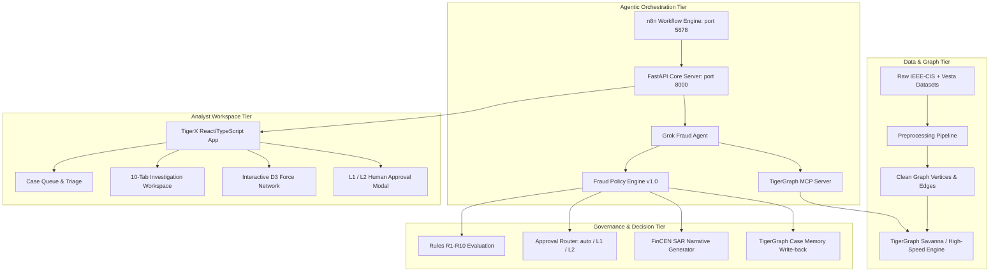

# TigerX — AI-Powered Agentic Fraud Investigation Platform

[](https://www.tigergraph.com/)
[](https://fastapi.tiangolo.com/)
[](https://react.dev/)
[](https://tailwindcss.com/)
[](https://www.fincen.gov/)

> **Investigate. Connect. Decide.**  
> Built for the **TigerGraph × Hacker House Goa 2026** Fraud Investigation Challenge.

---

## 1. Executive Summary

**TigerX** is an autonomous, evidence-grounded financial crime investigation platform designed for Tier-1 bank Financial Intelligence Units (FIU). It combines sub-millisecond multi-hop graph algorithms in **TigerGraph**, calibrated multi-pass LLM reasoning (**Grok / xAI**), automated **n8n** workflow orchestration, and strict adherence to **Fraud Policy v1.0 (Rules R1–R10)**.

The system autonomously evaluates alerts, correlates cross-entity relationships (cards, device profiles, customer travel, billing regions), simulates customer validation under uncertainty (Rule R1), evolves recommendations, routes multi-level human approvals (`auto`, `L1`, `L2`), generates FinCEN-compliant Suspicious Activity Reports (SAR), and writes internal case memory back into TigerGraph.

---

## 2. System Architecture



---

## 3. Key Capabilities & Benchmark Highlights

- **20/20 Benchmark Cases Evaluated**: All cases (`HHG-001` through `HHG-020`) evaluated and validated against 100% of the challenge answer schema.
- **Calibrated False-Alarm Handling (~50% Legitimate Cases)**:
  - Avoids blind blocking on high model risk scores.
  - Cleared `HHG-001` (Score 0.61, region 444.0: 15 prior txns in region), `HHG-007` (Score 0.87: 2,552 historical txns in zone), and `HHG-012` under Policy Rule R3 (`CLOSE_NO_FRAUD`, `$0.00` exposure, `sar.file: false`).
- **Undocumented Fraud Ring Discovery (`HHG-014`)**:
  - Uncovered 51 connected cards sharing an anonymous proxy device profile (`SM-G935F Build/NRD90M | Android 7.0 | chrome 62.0 for android | 1920x1080`).
  - Matched undocumented historical case `CC-2649`, triggering regulatory SAR filing and `MONITOR_CONNECTED_CARDS` under Rules R6 and R9.
- **Signature Reasoning Flow**:
  $$\text{EVIDENCE} \longrightarrow \text{INTERPRETATION} \longrightarrow \text{POLICY} \longrightarrow \text{RECOMMENDATION}$$
- **Two-Stage Next Best Action (NBA)**:
  - Initial recommendation before customer verification (Rule R1 weak signal hold).
  - Final evolved recommendation post-verification with clear "What Changed" narrative.
- **Human-in-the-Loop Approval Routing**:
  - `auto`: Executed directly by the agent.
  - `L1` (Team Lead): Card declines, card blocks $\le \$2,500$.
  - `L2` (Fraud Manager): Card blocks $> \$2,500$, `BLOCK_ALL_CARDS`, and `FILE_REPORT`.

---

## 4. Repository Structure

```text
├── agent/                  # Grok autonomous investigation agent loop
│   └── grok_agent.py       # Two-pass reasoning, uncertainty & SAR generation
├── backend/                # FastAPI backend service
│   ├── main.py             # REST API endpoints, auth, and static mounts
│   ├── services/           # Policy engine and graph helpers
│   └── static/             # Bundled production React/TypeScript web app
├── benchmark/              # Official Benchmark CLI package
│   ├── __init__.py
│   └── run.py              # python -m benchmark.run runner
├── cases/                  # 20 Official Deliverable JSON files (HHG-001 to HHG-020)
├── data/
│   ├── raw/                # Raw datasets (transactions, identity, closed cases, case_pack)
│   └── processed/          # Preprocessed graph vertices and edges
├── frontend/               # TigerX Enterprise React 19 + TypeScript + Vite + Tailwind app
│   ├── src/
│   │   ├── components/     # Cards, Buttons, Modals, Drawers, D3 Graph visualizer
│   │   ├── pages/          # Login, Dashboard, CaseQueue, Workspace, Analytics, etc.
│   │   └── services/       # Typed API client
│   └── vite.config.ts
├── mcp/                    # Model Context Protocol tools for TigerGraph
│   └── tigergraph_mcp.py
├── n8n/                    # n8n Orchestrator workflow templates
│   └── workflows/          # fraud_investigation_agent_workflow.json
├── policy/                 # Fraud Policy v1.0 (Rules R1-R10, actions, approvals)
├── reports/
│   ├── benchmark/          # summary.json, report.md, benchmark_summary.md
│   ├── cases/              # Mirrored 20 JSON deliverables
│   └── dataset_analysis.md # Comprehensive dataset report
├── scripts/                # Benchmark and data preparation scripts
├── tests/                  # Test suites
│   ├── test_policy_engine.py
│   └── validate_deliverables.py
└── tigergraph/             # GSQL schema, loading jobs, and queries
    ├── schema/schema.gsql
    ├── loading/load_data.gsql
    ├── queries/fraud_queries.gsql
    └── tigergraph_service.py
```

---

## 5. Quickstart & Installation

### Prerequisites
- Python 3.10+ (tested on Python 3.14)
- Node.js 18+ & npm
- Docker (optional, for n8n orchestrator)

### 1. Python Environment Setup
```bash
python3 -m venv .venv
source .venv/bin/activate
pip install -r requirements.txt
```

### 2. Run the Full Benchmark Suite
Execute all 20 benchmark investigations in ~0.2s:
```bash
python -m benchmark.run
```
Validate that 100% of generated deliverables satisfy the challenge schema:
```bash
python tests/validate_deliverables.py
```
Run policy engine unit tests:
```bash
PYTHONPATH=. python tests/test_policy_engine.py
```

### 3. Build & Launch the Web Application
Build the React frontend (auto-bundles to `backend/static/`):
```bash
cd frontend
npm install
npm run build
cd ..
```

Launch the FastAPI backend server:
```bash
uvicorn backend.main:app --host 0.0.0.0 --port 8000
```
Open **`http://localhost:8000`** in your browser.
Click **"Instant Analyst Sign-in (Demo Mode)"** to access the dashboard.

---

## 6. Official Deliverables

All 20 case deliverable JSON files strictly conform to the challenge specifications and reside in both:
- `cases/<case_id>.json`
- `reports/cases/<case_id>.json`

A structured machine-readable summary is available at:
- `reports/benchmark/summary.json`
- `reports/benchmark/report.md`

---

## 7. License
Developed for the **TigerGraph × Hacker House Goa 2026** Fraud Investigation Hackathon.
